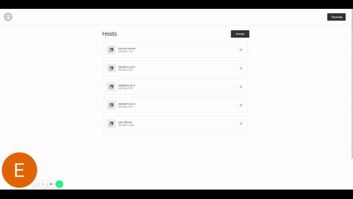

# drago

Drago is a cloud-agnostic configuration manager for WireGuard designed to make it simple to configure network overlays spanning cloud VMs and edge devices in a hybrid-cloud fashion.





## Build

System requirements:
- Golang 1.14+
- Node 10.17.0+
- yarn 1.12.3+


```
go generate
go build
```

## Usage

```
drago agent --config=<config_file>
```

## Development

For development purposes, we suggest that you start the web UI in dev mode:
```
cd ui
yarn start
```

Then start the Drago server:
```
go run main.go agent --config="./demo/server.yml"
```

And finally, build and run the Drago client as sudo:
```
go build
sudo ./drago --config="./demo/client.yml"
```

## Overview

Drago connects nodes in a cluster by providing an encrypted layer 3 network that can span across data centers and public clouds. By allowing pools of nodes in different locations to communicate securely, Drago enables the operation of multi-cloud clusters as well as the connection of edge and IoT devices.

Drago's design allows clients to VPN to a cluster in order to securely access services running on the cluster.

## How it works

Drago uses [WireGuard](https://www.wireguard.com/), a performant and secure VPN,to connect the different nodes in the cluster.

The Drago agent runs on every node in the cluster, setting up the public and private keys for the VPN as well as the necessary rules to route packets between locations.

Drago can operate both as a complete, independent networking provider as well as an add-on complimenting the cluster-networking solution currently installed on a cluster.

## TODO
- Simple auth for the management API
- Certificate-based client authentication
- Automatic generation of client tokens (in addition to CLI command)
- Integration with a production-grade DB such as Postgres
- Collect metrics from links (e.g., upstream/downstream traffic, last handshake, etc)
- Collection of host metrics (e.g., last seen)
- Input validation (backend + frontend)
- Allow for the management of multiple overlay networks
- Improvements in the overall architecture
- Refactoring (project layout, variables name)
- Persistent connections (e.g., using Websockets) for enchanced responsiveness
- Filtering + Pagination
- Topology graph improvements
- DB query optimization
